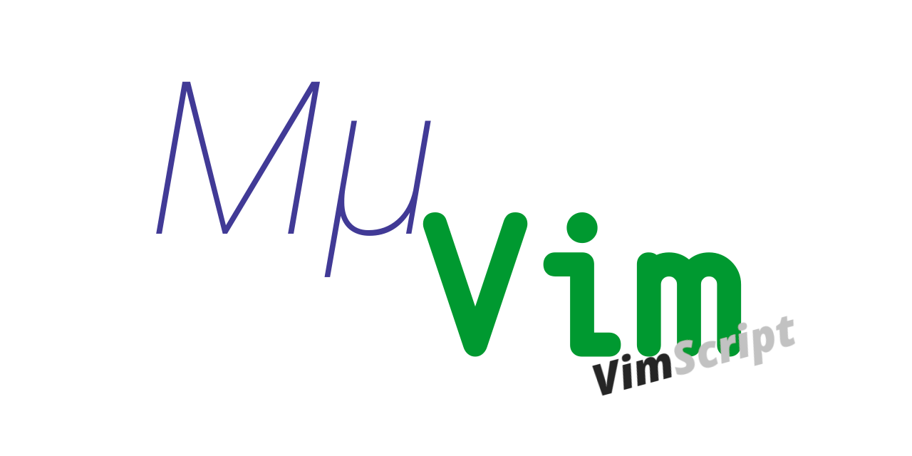
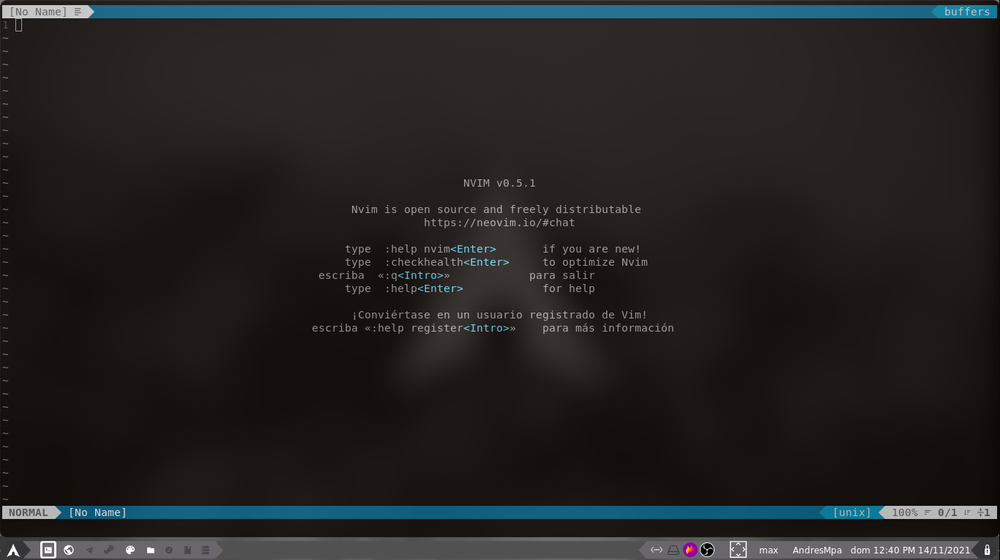
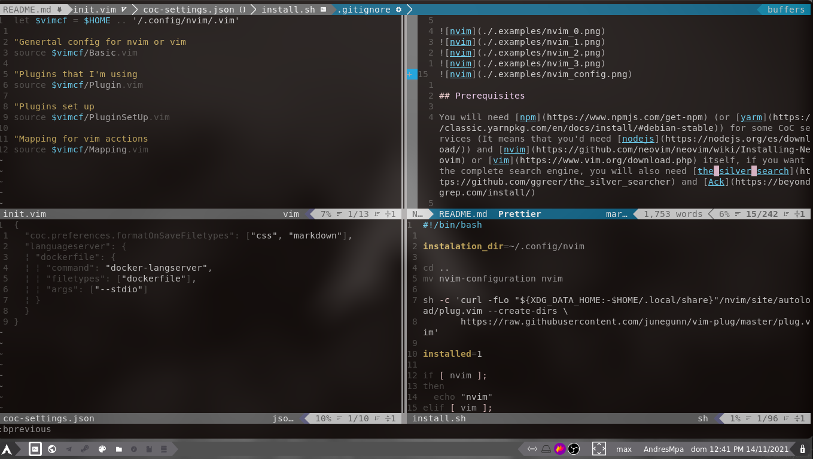
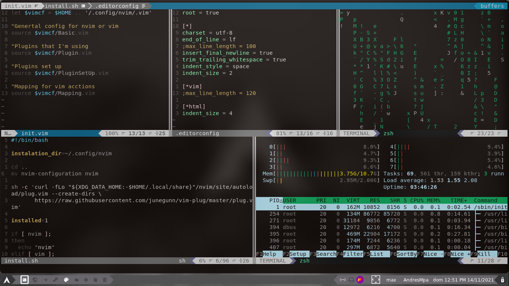
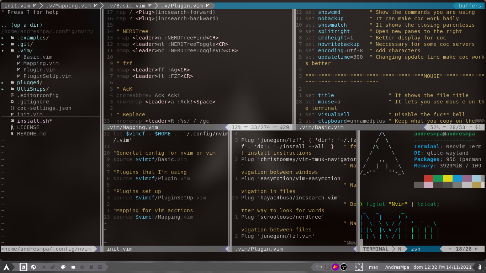

<div align="center">
  <p>
    <a href="https://github.com/AndresMpa/mu-nvim">
      
    </a>
    <a href="https://github.com/AndresMpa/mu-nvim">
      
    </a>
    <a href="https://github.com/AndresMpa/mu-nvim">
      
    </a>
  </p>
</div>

MμVim is three editor configs. This repository is **VimScript**: modular `.vim` files for Vim and Neovim, the LTS if you have not moved off Vim.

The other two are [Current](https://github.com/AndresMpa/mu-vim) (Lua, Neovim only) and [Mini](https://github.com/AndresMpa/mu-vim-mini) (one `init.vim`). Docs: [andresmpa.github.io/mu-vim-page](https://andresmpa.github.io/mu-vim-page/).

## Screenshots







Startify is the greeter (`f` find files, `n` file tree, `g` git status).

## Prerequisites

[Neovim](https://github.com/neovim/neovim/wiki/Installing-Neovim) or [Vim](https://www.vim.org/download.php). The installer pulls vim-plug, Node, and pnpm.

## Quick Start

| OS | Package manager | Config dir |
| --- | --- | --- |
| Linux Arch / Manjaro | pacman | `~/.config/nvim` |
| Linux Debian / Ubuntu | apt | `~/.config/nvim` |
| Linux Fedora / RHEL | dnf | `~/.config/nvim` |
| macOS | [Homebrew](https://brew.sh) | `~/.config/nvim` |
| Windows | clone by hand | `%LOCALAPPDATA%\nvim` |

Linux and macOS:

```
git clone https://github.com/AndresMpa/mu-vim-vimscript.git ~/.config/nvim
cd ~/.config/nvim
./install.sh
nvim
```

On a Mac, install Homebrew first.

Then `<Space> p i`, `:source %`, `:CocInstall`, and `:call mkdp#util#install()`. CoC uses **Biome** for JS/TS, Prettier for HTML/Markdown, **Volar** (`@yaegassy/coc-volar`) for Vue, and **Go** as the extra language server.

Windows: clone into `%LOCALAPPDATA%\nvim` and run Plug / CoC by hand.

## Uninstall

Removes the config, vim-plug, CoC, cache, and `old-nvim`. Leaves Neovim and Homebrew/apt packages.

```
cd ~/.config/nvim
./delete.sh
```

`<Space> h h` lists maps. Native motions: [CheatSheet.md](./CheatSheet.md). Plugins are declared in `.vim/Plugin.vim`.

## Related tools

- [rofi](https://github.com/davatorium/rofi)
- [Ulauncher](https://ulauncher.io/)
- [Zeal](https://zealdocs.org/)
- [Vimium](https://addons.mozilla.org/firefox/addon/vimium-ff/)
- [Arch Linux](https://github.com/AndresMpa/dotfiles)
